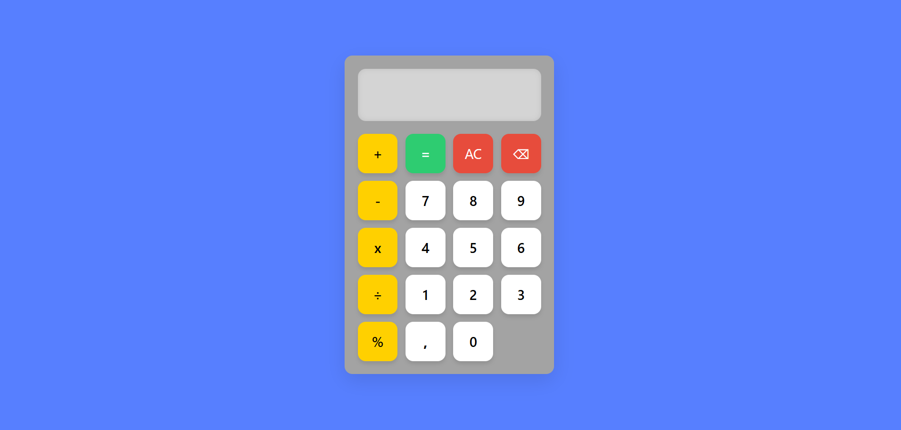

# 🧮 Calculadora Web Interativa

Uma calculadora moderna e responsiva construída com HTML, CSS e JavaScript puro, perfeita para uso no dia a dia ou como projeto de aprendizado.

## 🔗 Demo Online
[▶️ Acesse a Calculadora Aqui](https://EduardoPec.github.io/calculator/) 

## 🚀 Recursos

- **Operações básicas**: `+`, `-`, `×`, `÷`
- **Funções especiais**: `%`, `.`, `AC`, `⌫`
- **Design responsivo** para todos os dispositivos
- **Feedback visual** em botões
- **Tratamento de erros** inteligente

## 🎯 Tecnologias


## 📸 Screenshots

| Desktop | Mobile |
|---------|--------|
|  |  |

## 🛠️ Como Executar

```bash
git clone https://github.com/EduardoPec/calculator.git
